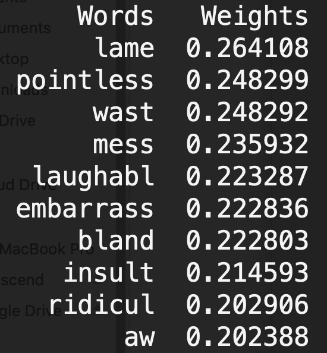
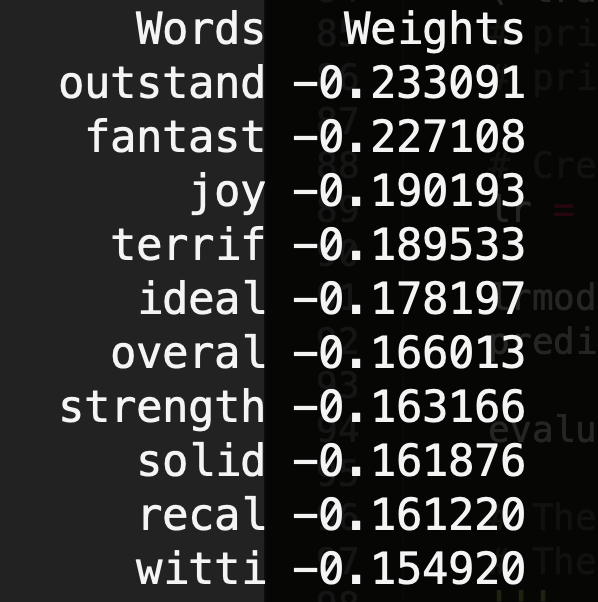

# Text classfication using PySpark

In this repo, PySpark is used to solve a binary text classification problem. The whole procedure can be find in [Here](main.py).

## Data 
Our task here is to general a binary classifier for IMDB movie reviews. The data was collected by Cornell in 2002 and can be downloaded from [Here](http://www.cs.cornell.edu/people/pabo/movie-review-data/).

Before building the models, the raw data (1000 positive and 1000 negative TXT files) is stemmed and integrated into a single CSV file. The code can be find [Here](index-data.py). 

There are only two columns in the dataset:
* comments: contents in each review
* category: neg/pos.

After importing the data, three main steps are used to process the data:
* RegexTokenizer: tokenize each content
* StopWordsRemover: remove stop words like "a, the, an, I ..."
* StringIndexer: encode a string column of labels to a column of label indices

All of those steps can be found in function _ProcessData( df )_

## Feature Selection and Model Training

In this repo, both _Term Frequency_ and _TF-IDF_ Score are implemented to get features. However, for this text classfication problem, we only used TF here (will explain later).

Logisitic Regression is used here for the binary classifition. 
```
lr = LogisticRegression(maxIter=10, regParam=0.3, elasticNetParam=0)
lrmodel = lr.fit( trainData )

prediction = lrmodel.transform( testData )
evaluator = BinaryClassificationEvaluator(rawPredictionCol="prediction")
```
and the accuracy of classifier is: 0.860470992521 (not bad...)

## Analysis

Based on the Logistic Regression model, the importance of each feature can be revealed by the coefficient in the model. In order to get the whole vocabulary, the TF model is used instead of TF-IDF (In PySpark, a hashing trick is used to generate TF-IDF score and it's impossible to get the original vocabulary).

Therefore, by ranking the coefficients from the classifier, we can get the important features (keywords) in each class. The top 10 features for each class are shown below.


<p align="center">


</p>
<p align="center">
<em>Left: top 10 keywords for negative class; Right: top 10 keywords for positive class </em>
</p>
